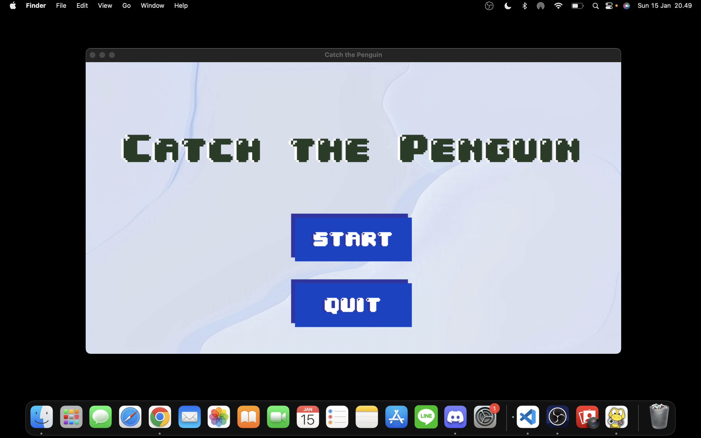
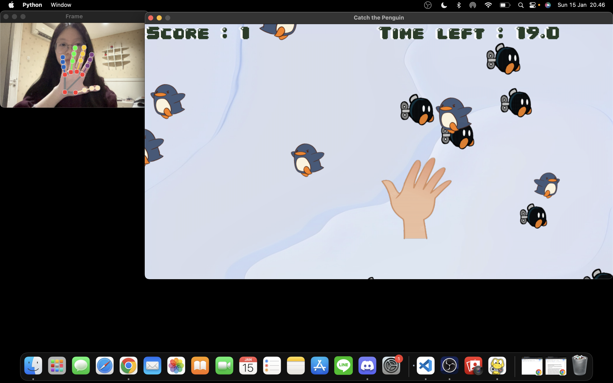
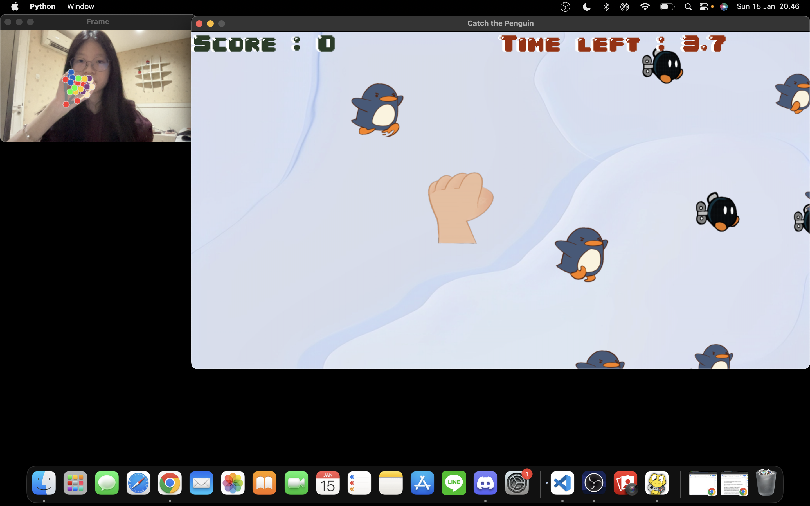
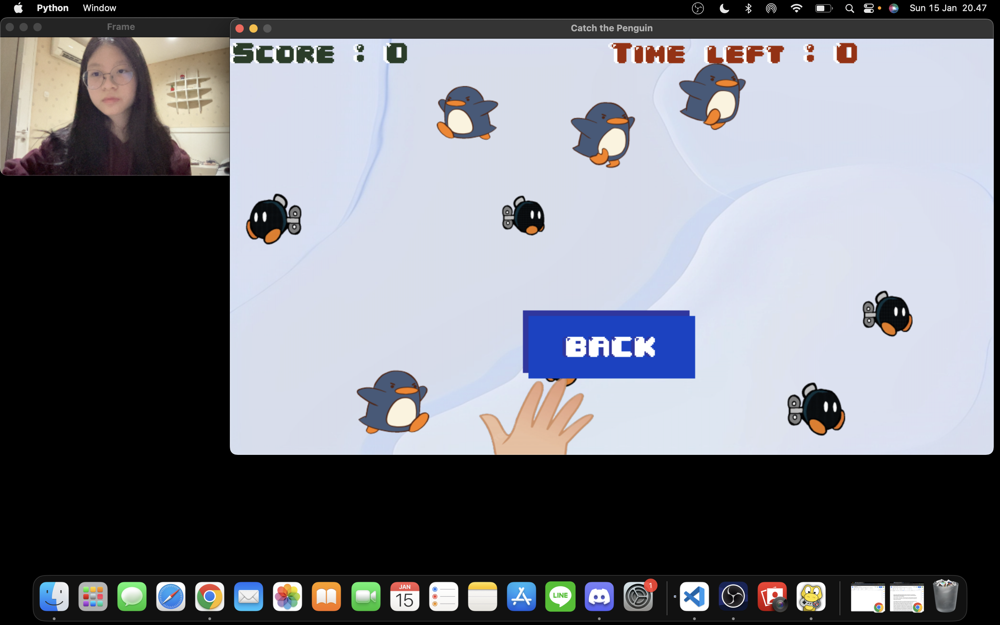

<h1 align="center">🐧 Catch the Penguin</h1> 
This is the repository for Clarissa Audrey Fabiola's Algorithm and Programming final project.

## ✋✊ Game Description 🐧💣
Catch the Penguin is a fun and engaging game that utilizes hand tracking technology through a webcam. Players use their hand to capture penguins while avoiding bombs on the screen. The objective is to score the highest points possible within the limited time of the game. With an increasing difficulty, players will have to be quick and strategic to beat the game. Give it a try and see how many penguins you can catch!

## 🎥 Demo Video
Video demonstration can be accessed [here](https://www.youtube.com/watch?v=MJOpq9aGABI).

## 📁 File Directory
- 'Documents' folder - contains report pdf file, screenshots of the game, and diagram images for this game.
- 'Assets' folder - contains all fonts, images, and sounds used in the game.
- background.py - contains the class Background in charge of displaying the background of the game on the screen.
- constant.py - contains a set of constant variables that are used throughout the game.
- game.py - contains the class Game in charge of creating the logic behind the game.
- hand_tracking.py - contains the class HandTracking in charge of tracking and detecting the position of a hand using the Mediapipe library.
- hand.py - contains the class Hand in charge of the hand object that represents the player's hand in the game.
- main.py - contains the main file that runs the game.
- menu.py - contains the class Menu in charge of creating the menu of the game.
- penguin.py - contains the class Penguin in charge of the penguin object.
- ui.py - contains the function for the user interface.

## 📚 Dependencies
- Pygame - a set of Python modules designed for writing video games. Used in the game to create the window, handling user input, drawing images on the screen, and playing sounds.
- OpenCv - a library of programming functions mainly aimed at real-time computer vision. Used in the game for capturing and processing webcam frames to track the player’s hand in real-time. 
- MediaPipe - an open-source framework developed by Google for building cross-platform multimodal applied ML (Machine Learning) pipelines. Used in the game for hand detection and tracking, for drawing collision boxes around the detected hand, and for determining the position of the hand in the webcam frame.

```
pip install pygame
pip install opencv-python
pip install mediapipe
```
## 👾 How to Run the Game
- Download and extract the zip file from this repository.
- Open Visual Studio Code (VSC).
- Open the files through VSC.
- Run the main.py file.
- Have fun! 

## 📷 Screenshots of the Game





